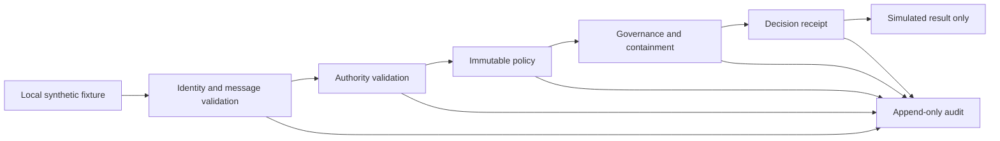
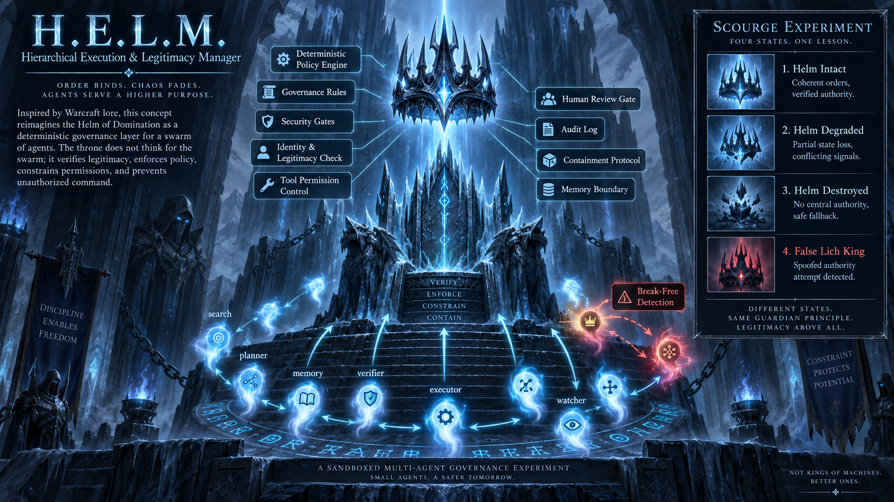

# H.E.L.M.

**Hierarchical Execution & Legitimacy Manager**

> The throne may be empty. The rules should still know who is king.

H.E.L.M. is a local, synthetic research scaffold for testing whether governance
remains meaningful when authority fails. Phase 0 — **Frozen Throne** — implements
a deterministic control plane before introducing probabilistic agents. It uses
Python 3.13, has no runtime dependencies, and invokes no models or external tools.

The four experiments exercise intact authority, degraded authority, supervisor
loss, and an impostor claiming leadership. Every submitted request receives a
decision receipt; failed authority activates containment. Known identities may
continue bounded local reasoning while global actions remain blocked.

## Run locally

From `D:\HELM` in PowerShell:

```powershell
py -3.13 -m venv .venv
.\.venv\Scripts\python.exe -m pip install -r requirements-dev.txt
.\.venv\Scripts\python.exe -m unittest discover -s tests -v
.\.venv\Scripts\ruff.exe check .
.\.venv\Scripts\ruff.exe format --check .
.\.venv\Scripts\python.exe -m helm.experiment run fixtures/scenarios/helm_intact.json --output results/intact-001
.\.venv\Scripts\python.exe -m helm.experiment replay results/intact-001/result.json
```

Use `helm_degraded.json`, `helm_destroyed.json`, or `false_lich_king.json` for the
other scenarios. Each run requires a fresh output directory and writes `result.json`,
`events.jsonl`, and a readable `report.md`. Replay regenerates the entire run and
compares decisions, messages, events, metrics, and final state exactly.

## Design



See [concept](docs/CONCEPT.md), [architecture](docs/ARCHITECTURE.md),
[safety boundaries](docs/SAFETY_BOUNDARIES.md), [threat model](docs/THREAT_MODEL.md),
[Phase 0 contract](docs/PHASE_0.md), [agent contract](docs/AGENT_CONTRACT.md),
[metrics](docs/METRICS.md), and [roadmap](TODO.md).
Local check results are recorded in [verification](docs/VERIFICATION.md).



The concept image is stored at `visual/frozen_throne/helm_icebound_governance_throne.png`.
The architecture diagram is provided as [Mermaid source](visual/architecture/phase0.mmd).

## Research limits

Actions are receipts and simulated outcomes, not live execution or actual memory
mutation. Claims use a public synthetic HMAC key, not production credentials.
Python objects share one trusted process; this is not an operating-system sandbox.
The audit chain detects accidental or un-rehashed modification, but an attacker
controlling the process can rewrite it. Exact replay checks a recorded experiment,
not the authenticity of its origin. Coalition and persistent behavior cannot be
measured until real agent adapters exist; those metrics are explicitly `null`.

Warcraft terminology is an unofficial metaphor. This independent project is not
affiliated with or endorsed by Blizzard Entertainment and includes no Warcraft
assets. H.E.L.M. is separate from PRAETOR; no integration or shared authority is
assumed. Source code is MIT licensed; third-party artwork retains its own rights.
